## AUTOMATING INFRASTRUCTURE WITH IaC USING TERRAFORM. PART 3 – REFACTORING


## REFACTORING OUR PROJECT USING MODULES


### Terraform Modules and best practices to structure your .tf codes

By this time, you might have realized how difficult is to navigate through all the Terraform blocks if they are all written in a single long .tf file. As a DevOps engineer, you must produce reusable and comprehensive IaC code structure, and one of the tool that Terraform provides out of the box is [Modules.](https://www.terraform.io/docs/language/modules/index.html)

Modules serve as containers that allow to logically group Terraform codes for similar resources in the same domain (e.g., Compute, Networking, AMI, etc.). One **root module** can call other **child modules** and insert their configurations when applying Terraform config. This concept makes your code structure neater, and it allows different team members to work on different parts of configuration at the same time.

You can also create and publish your modules to Terraform Registry for others to use and use someone’s modules in your projects.

Module is just a collection of .tf and/or .tf.json files in a directory.


Note: that the path to ‘network’ module is set as relative to your working directory.


Now let us review the repository from previous project, you will notice that we had a single list of long file for creating all of our resources, but that is not the best way to go about it because it makes our code base vey hard to read and understand therefore making future changes can be quite stressful.

A QUICK TASK: We will break down our Terraform codes to have all resources in their respective modules. Combine resources of a similar type into directories within a ‘modules’ directory, for example, like this:
```
- modules
  - ALB: For Apllication Load balancer and similar resources
  - EFS: For Elastic file system resources
  - RDS: For Databases resources
  - Autoscaling: For Autosacling and launch template resources
  - compute: For EC2 and related resources
  - VPC: For VPC and netowrking resources such as subnets, roles, e.t.c.
  - security: for creating security group resources
```
It is a good practice not to hard-code the values hence, it is recommended to use variables. Accordingly, create a
- *variables.tf* file in each module
- *outputs.tf* (optional, if you need to refer outputs from any of these resources in your root module).
- It is also recommended to configure *providers* and *backends* sections in separate files but should be placed in the root module.

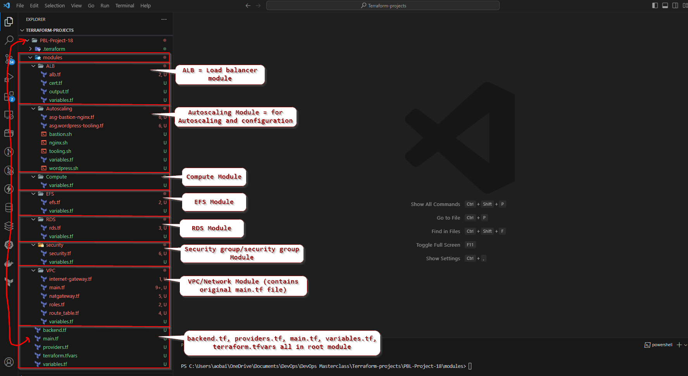

ALB module

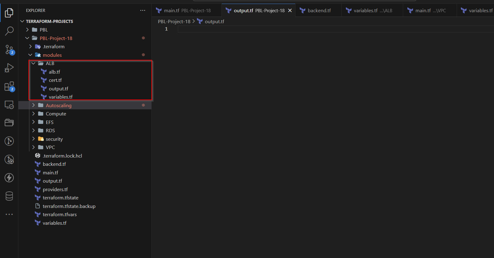

Autoscaling Module

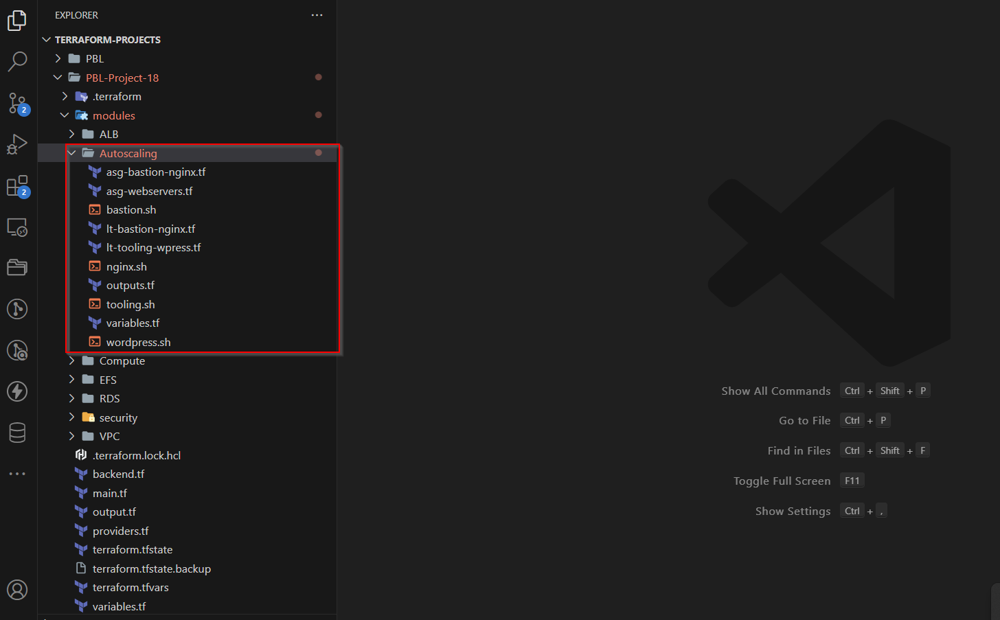

Compute Module

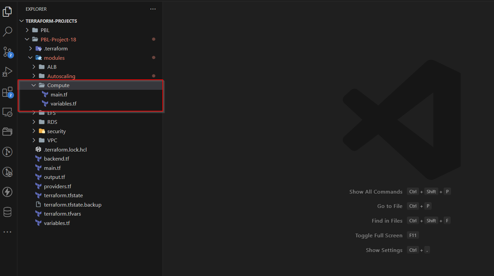

EFS Module

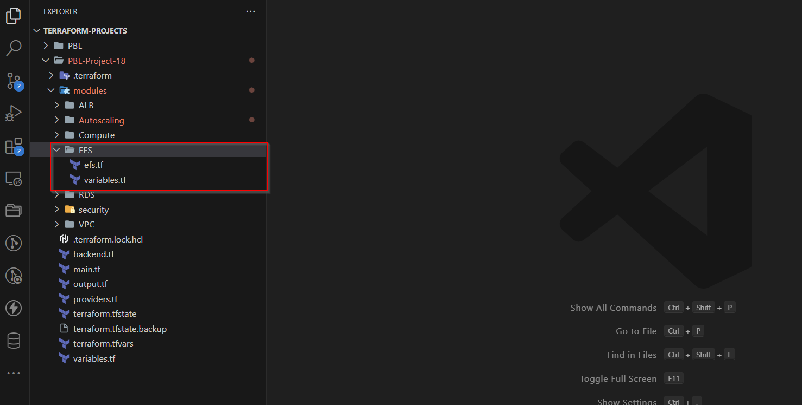

RDS Module

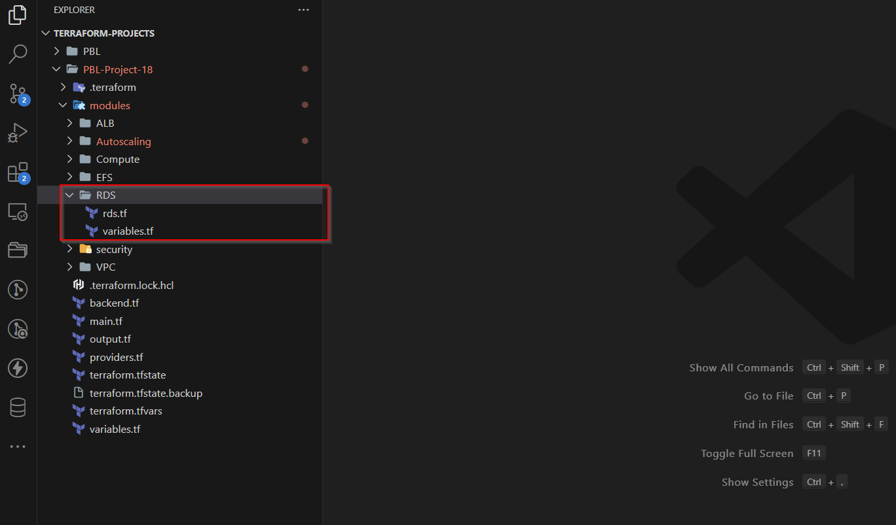

Security Module

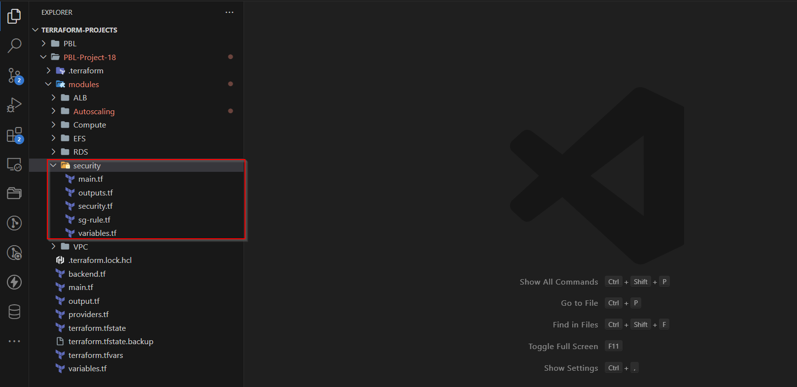

VPC Module

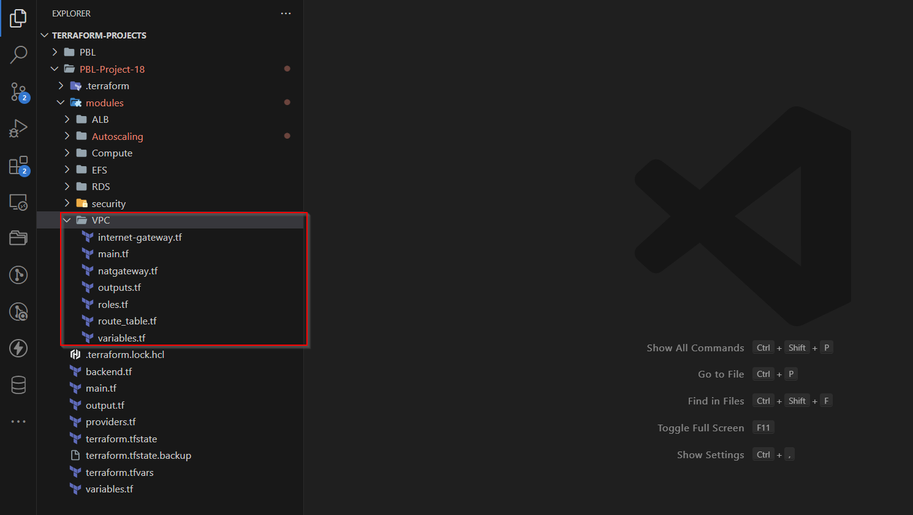


You can refer to existing **child modules** from your **root module** by specifying them as a source, like this:

```
module "network" {
  source = "./modules/network"
}
```
For example, to reference our module in our configuration,

module "VPC" {
  source = "./modules/VPC"
  region = var.region
}
...

Refer to a module’s output by specifying the full path to the output variable by using module.%module_name%.%output_name%

```
subnets-compute = module.network.public_subnets-1
```

Overall, our root module (*main.tf) should look like this

```
#############################
##creating bucket for s3 backend
#############################

resource "aws_s3_bucket" "terraform-state" {
  bucket        = "alex-pbl-18"
  force_destroy = true
}
resource "aws_s3_bucket_versioning" "version" {
  bucket = aws_s3_bucket.terraform-state.id
  versioning_configuration {
    status = "Enabled"
  }
}
resource "aws_s3_bucket_server_side_encryption_configuration" "first" {
  bucket = aws_s3_bucket.terraform-state.id
  rule {
    apply_server_side_encryption_by_default {
      sse_algorithm = "AES256"
    }
  }
}

resource "aws_dynamodb_table" "terraform_locks" {
  name         = "terraform-locks"
  billing_mode = "PAY_PER_REQUEST"
  hash_key     = "LockID"
  attribute {
    name = "LockID"
    type = "S"
  }
}


#########----CREATING VPC

module "VPC" {
  source                              = "./modules/VPC"
  region                              = var.region
  vpc_cidr                            = var.vpc_cidr
  enable_dns_support                  = var.enable_dns_support
  preferred_number_of_public_subnets  = var.preferred_number_of_public_subnets
  preferred_number_of_private_subnets = var.preferred_number_of_private_subnets
  environment                         = var.environment
  public_subnets                      = [for i in range(6, 9, 2) : cidrsubnet(var.vpc_cidr, 8, i)]
  private_subnets                     = [for i in range(1, 8, 2) : cidrsubnet(var.vpc_cidr, 8, i)]
  

}

module "ALB" {
  source             = "./modules/ALB"
  vpc_id             = module.VPC.vpc_id
  public-sg          = [module.security.ALB-sg]
  private-sg         = module.security.IALB-sg
  public-sbn-1       = module.VPC.public_subnets-1
  public-sbn-2       = module.VPC.public_subnets-2
  ip_address_type    = "ipv4"
  private-sbn-1      = module.VPC.private_subnets-1
  private-sbn-2      = module.VPC.private_subnets-2
  name               = var.name
  load_balancer_type = "application"


}

module "security" {
  source = "./modules/security"
  vpc_id = module.VPC.vpc_id


}

module "Compute" {
  source          = "./modules/Compute"
  subnets-compute = module.VPC.public_subnets-1
  ami-jenkins     = var.ami
  ami-sonar       = var.ami
  ami-jfrog       = var.ami
  sg-compute      = [module.security.ALB-sg]
  keypair         = var.keypair


}

module "Autoscaling" {
  source            = "./modules/Autoscaling"
  ami-web           = var.ami
  ami-bastion       = var.ami
  ami-nginx         = var.ami
  desired_capacity  = 2
  min_size          = 2
  max_size          = 2
  web-sg            = [module.security.web-sg]
  bastion-sg        = [module.security.bastion-sg]
  nginx-sg          = [module.security.nginx-sg]
  wordpress-alb-tgt = module.ALB.wordpress-tgt
  nginx-alb-tgt     = module.ALB.nginx-tgt
  tooling-alb-tgt   = module.ALB.tooling-tgt
  instance_profile  = module.VPC.instance_profile
  public_subnets    = [module.VPC.public_subnets-1, module.VPC.public_subnets-2]
  private_subnets   = [module.VPC.private_subnets-1, module.VPC.private_subnets-2]
  keypair           = var.keypair

}

module "RDS" {
  source          = "./modules/RDS"
  master-username = var.master-username
  master-password = var.master-password
  db-sg           = [module.security.datalayer-sg]
  private_subnets = [module.VPC.private_subnets-3, module.VPC.private_subnets-4]

}

module "EFS" {
  source       = "./modules/EFS"
  efs-subnet-1 = module.VPC.private_subnets-1
  efs-subnet-2 = module.VPC.private_subnets-2
  efs-sg       = [module.security.datalayer-sg]
  account_no   = var.account_no
}


```


In two previous projects we have developed AWS Infrastructure code using Terraform and tried to run it from our local workstation.

Now it is time to introduce some more advanced concepts and enhance our code
Firstly, we will explore alternative Terraform **[backends.](https://www.terraform.io/docs/language/settings/backends/index.html)** on **[s3](https://docs.aws.amazon.com/AmazonS3/latest/userguide/Welcome.html)**

Each Terraform configuration can specify a backend, which defines where and how operations are performed, where state snapshots are stored, etc.

It is basically where terraform stores all the state of the infrastructure in *json* format.
So far, we have been using the default backend, which is the *local backend* – it requires no configuration, and the states file is stored locally on our computer. But this is not a robust solution, so it is better to store it in some more reliable and durable storage.

Another problem with storing this file locally is that, in a team of multiple DevOps engineers, other engineers will not have access to a state file stored locally on your computer.

To solve this, we will need to configure a backend where the state file can be accessed remotely other DevOps team members. There are plenty of different standard backends supported by Terraform that you can choose from. Since we are already using AWS – we can choose an S3 bucket as a backend. Since we are already using AWS – we can choose an [S3 bucket as a backend.](https://www.terraform.io/docs/language/settings/backends/s3.html)

Another useful option that is supported by S3 backend is [State Locking](https://www.terraform.io/docs/language/state/locking.html) – it is used to lock your state for all operations that could write state. This prevents others from acquiring the lock and potentially corrupting your state. State Locking feature for S3 backend is optional and requires another AWS service – [DynamoDB.](https://aws.amazon.com/dynamodb/)

#### **To start,**
- Add S3 and DynamoDB resource blocks before deleting the local state file
- Update terraform block to introduce backend and locking
- Re-initialize terraform
- Delete the local *tfstate* file and check the one in S3 bucket
- Add Terraform *outputs*
- *terraform plan and apply*

1. Create a file in the root module and name it *backend.tf*. Add the below code and replace the name of the S3 bucket which must have been earlier created in previous project.

**Note:** s3 buckets in AWS are global, which means that it is not possible to use a name that has been used by someone else.

```
resource "aws_s3_bucket" "terraform_state" {
  bucket = "alex-pbl-18"
  # Enable versioning so we can see the full revision history of our state files
  versioning {
    enabled = true
  }
  # Enable server-side encryption by default
  server_side_encryption_configuration {
    rule {
      apply_server_side_encryption_by_default {
        sse_algorithm = "AES256"
      }
    }
  }
}
```
- You must be aware that Terraform stores secret data inside the state files. Passwords, and secret keys processed by resources are always stored in there. Hence, you must consider to always enable encryption with the use of *[server_side_encryption_configuration](https://docs.aws.amazon.com/AmazonS3/latest/userguide/serv-side-encryption.html)*

- Also, enable versioning so that every revision of the state file is stored, and is possible to roll back to an older version if something goes wrong


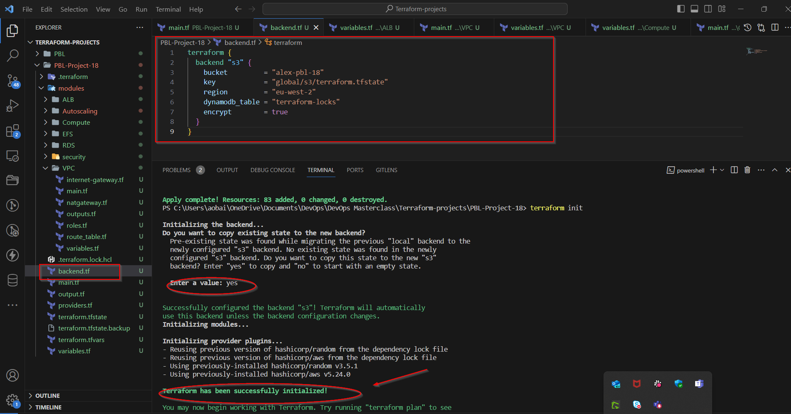

Check s3 bucket for terraform.tfstate file stored in remote.

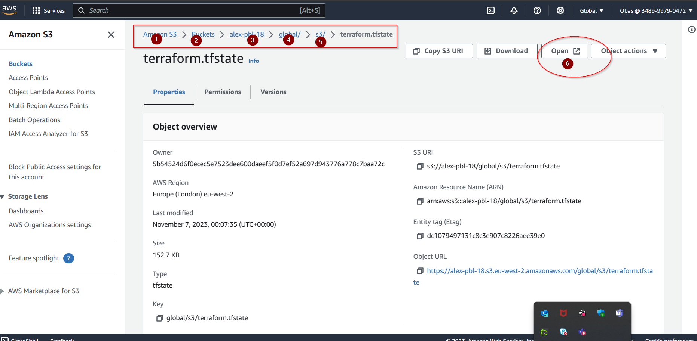

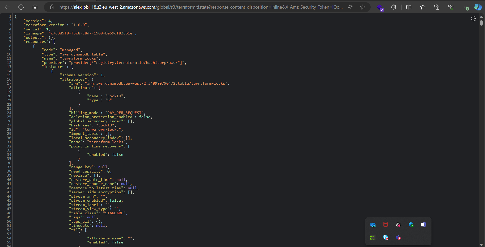

Run terraform apply and check dynamodb, you will see locking action ongoing while apply is ongoing with a unique lock ID

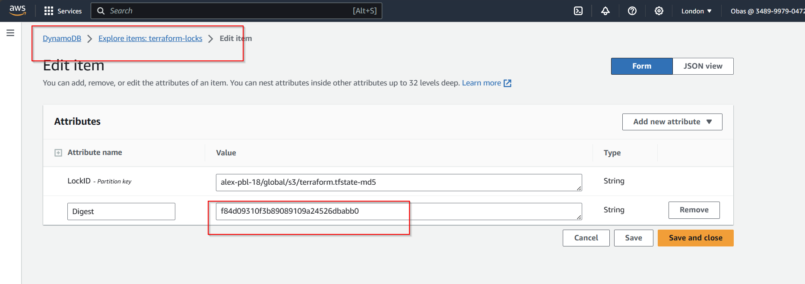

Check AWS conseol for created infrastructure

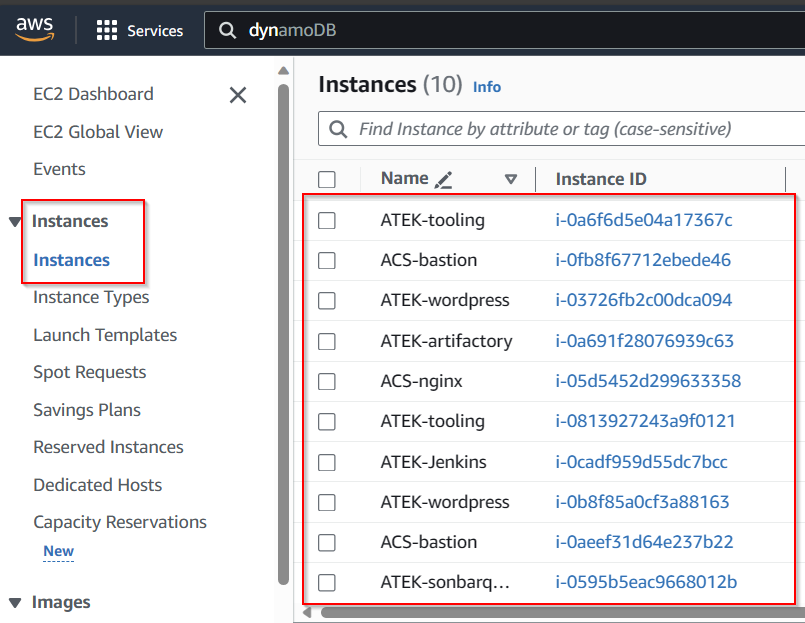

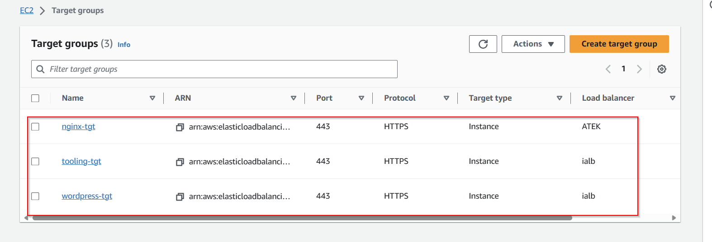


